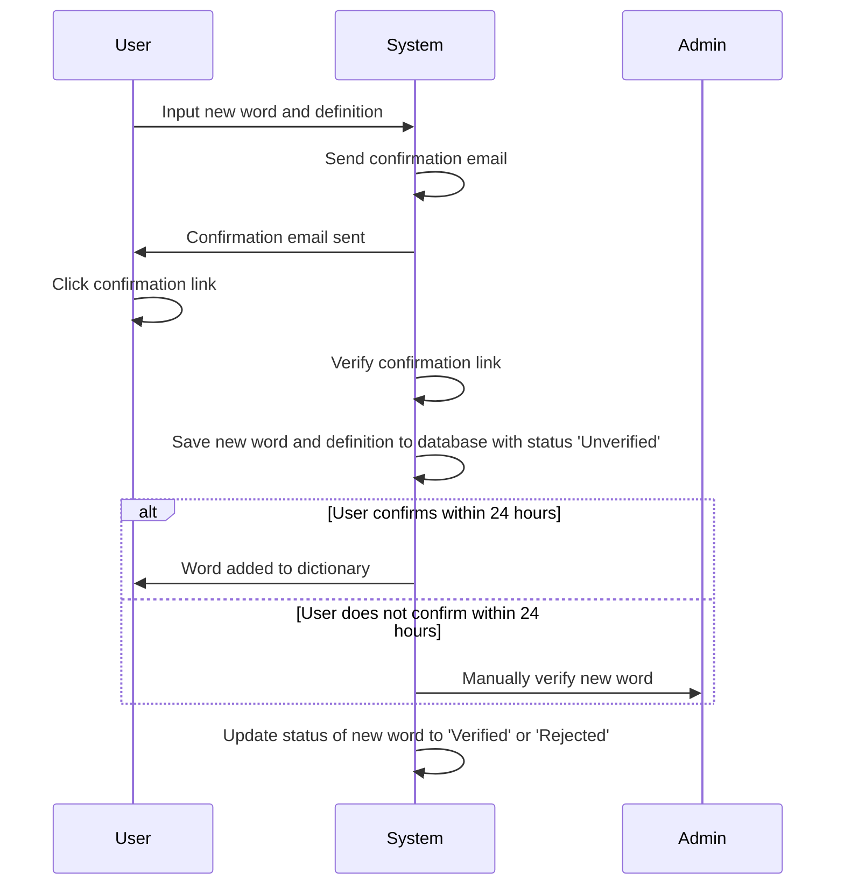
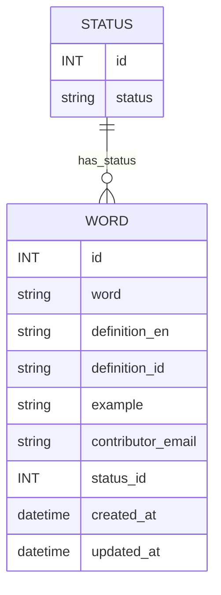
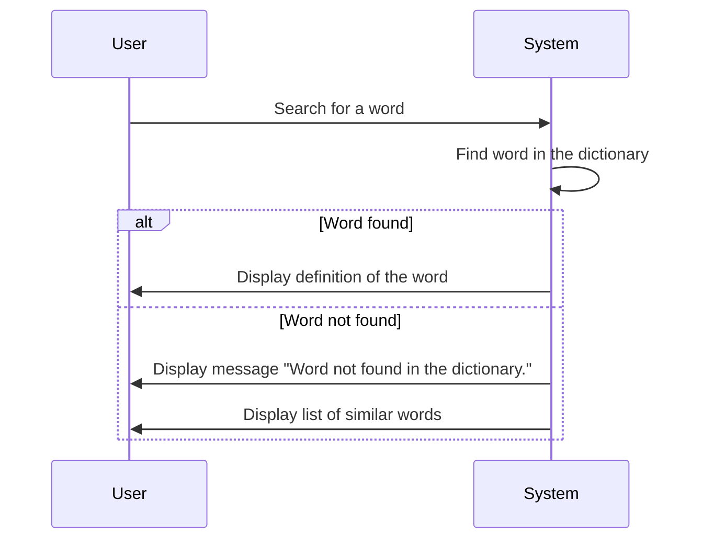
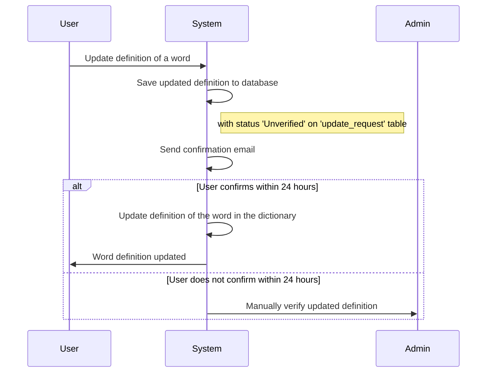
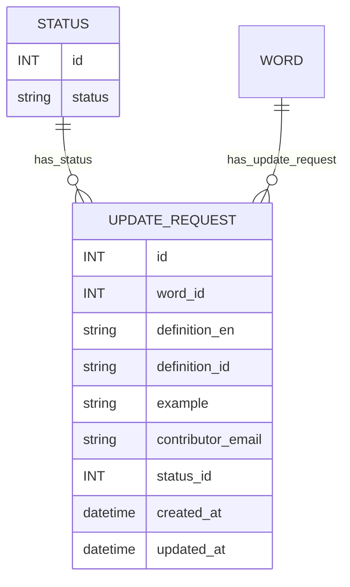

# User Story

This is a user story. It is a description of a feature from the perspective of the user. It is written in a way that is easy to understand and can be used to guide the development of the feature. In this context, we will describe the user story for this archive website and system.

## Example

```markdown
## As a [type of user], I want to [do something], so that [I can achieve some goal].

### Acceptance Criteria

- [ ] Criteria 1
- [ ] Criteria 2

### Additional Information

- [ ] Additional Information 1
- [ ] Additional Information 2
```

## User Story 1 - Dictionary Feature

As a user, I want to be able input a new word and its definition, so that I can add new words to the dictionary.

### Acceptance Criteria of User Story 1

- [ ] The user should be able to input a new word and its definition.
- [ ] The user should add their Email Address for data integrity, tracking, and logging purposes.
  - [ ] The system should send a confirmation email to the user's email address.
  - [ ] The user should click the confirmation link in the email to confirm the addition of the word to the dictionary.
  - [ ] The confirmation link should expire after 24 hours.
  - [ ] The user should be able to resend the confirmation email if they did not receive it.
- [ ] If the user does not confirm the addition of the word to the dictionary within 24 hours, the word should manually verified by the admin.
- [ ] The user can add the definition in English or Indonesian, or both.
- [ ] However, the user must add at least one definition.
- [ ] The new word and its definition should be saved to the database.
- [ ] The new word should be unique. If the word already exists in the dictionary, an appropriate message should be displayed to the user.

### Additional Information of User Story 1

Here is the sequence diagram of the user story:



**NOTE**: On database, the word should be saved in lowercase. When searching for a word, the system should convert the search query to lowercase.

Here is the database schema for the dictionary:



The status of the word should be one of the following:

- Unverified
- Verified
- Rejected
- Deleted (Soft Delete)

Here is API request and response for the dictionary feature:

The json request should be in the following format:

```json
{
  "word": "marondong",
  "definition": {
    "en": "Tomorrow, the day after today.",
    "id": "Besok, hari setelah hari ini."
  },
  "example": "na lamba a marondong",
  "contributor_email": "user@email.com"
}
```

The json response should be in the following format:

> Success Response - 200

```json
{
  "status": "success",
  "message": "Word 'marondong' has been added to the dictionary."
}
```

> Error Response

- Invalid Request - 400

```json
{
  "status": "error",
  "message": "Invalid request."
}
```

- Word Already Exists - 409

```json
{
  "status": "error",
  "message": "Word 'marondong' already exists in the dictionary."
}
```

- Internal Server Error - 500

```json
{
  "status": "error",
  "message": "Internal server error."
}
```

## User Story 2 - Search Feature

  As a user, I want to be able to search for a word in the dictionary, so that I can find the definition of the word.

### Acceptance Criteria of User Story 2

- [ ] The user should be able to search for a word in the dictionary.
- [ ] The definition of the word should be displayed to the user.
- [ ] If the word is not found, an appropriate message should be displayed to the user.
  - [ ] The message should be "Word not found in the dictionary."
  - [ ] Below the message, a list of similar words should be displayed to the user.
- [ ] The search should be case-insensitive.
- [ ] The search should be able to handle partial matches. For example, if the user searches for "maro", the word "marondong" should be displayed in the search results.

### Additional Information of User Story 2

Here is the sequence diagram of the user story:



Here is API request and response for the search feature:

The json request should be in the following format:

```json
{
  "word": "marondong"
}
```

The json response should be in the following format:

- Success Response - 200

```json
{
  "status": "success",
  "word": "marondong",
  "definition": {
    "en": "Tomorrow, the day after today.",
    "id": "Besok, hari setelah hari ini."
  },
  "example": "na lamba a marondong"
}
```

- Error Response

- Not Found - 404

```json
{
  "status": "error",
  "message": "Word not found in the dictionary.",
  "similar_words": ["marandang", "mangiang", "mabongi"]
}
```

- Invalid Request - 400

```json
{
  "status": "error",
  "message": "Invalid request."
}
```

- Internal Server Error - 500

```json
{
  "status": "error",
  "message": "Internal server error."
}
```

## User Story 3 - Update Feature

- As a user, I want to be able to update the definition of a word in the dictionary, so that I can correct or improve the definition of the word.

### Acceptance Criteria of User Story 3

- [ ] The user should be able to update the definition of a word in the dictionary.
- [ ] The updated definition should be saved to the database.
- [ ] The user should add their Email Address for data integrity, tracking, and logging purposes.
  - [ ] The system should send a confirmation email to the user's email address.
  - [ ] The user should click the confirmation link in the email to confirm the update of the word in the dictionary.
  - [ ] The confirmation link should expire after 24 hours.
  - [ ] The user should be able to resend the confirmation email if they did not receive it.

### Additional Information of User Story 3

Here is the sequence diagram of the user story:



Here is the database schema for the update request:



Here is API request and response for the update feature:

The json request should be in the following format:

```json
{
  "word": "marondong",
  "definition": {
    "en": "Tomorrow, the day after today.",
    "id": "Besok, hari setelah hari ini."
  },
  "example": "na lamba a marondong",
  "contributor_email": "user@email.com",
}
```

The json response should be in the following format:

- Success Response - 200

```json
{
  "status": "success",
  "message": "Definition of word 'marondong' has been updated."
}
```

- Error Response

- Invalid Request - 400

```json
{
  "status": "error",
  "message": "Invalid request."
}
```

- Internal Server Error - 500

```json
{
  "status": "error",
  "message": "Internal server error."
}
```

## User Story 4 - Dictionary Page

As a user, I want to be able to view all the words in the dictionary, so that I can browse and search for words easily by using English, Indonesian, or Mandar language. If I click on a word, I should be able to view its definition. Then, if I see a word with an incorrect definition, I should be able to update the definition of the word.

### Acceptance Criteria of User Story 4

- [ ] The user should be able to view all the words in the dictionary.
  - [ ] The page should display the words in a paginated list.
- [ ] The words should be displayed in alphabetical order.
- [ ] The status of each word should be displayed.
- [ ] The user should be able to click on a word to view its definition.
- [ ] The user should be able to filter the words by status (verified, unverified).
- [ ] The user should be able to search for a word in the dictionary.
- [ ] The user should be able to update the definition of a word.
- [ ] The user should be able to add a new word to the dictionary.
- [ ] The user should be able to view the details of the word, such as the contributor's email address and the date the word was added.
- [ ] The user should be able search for a word in English, Indonesian, or Mandar language. (Next Feature)

### Additional Information of User Story 4

Here is the case diagram of the user story:

```mermaid
graph TD
    A[User] --> B(Dictionary Page)
    B --> C(View All Words)
    B --> D(Filter Words)
    B --> E(Search Word)
    B --> F(Update Definition)
    B --> G(Add New Word)
    B --> H(View Word Details)
    B --> I(Search Word in English, Indonesian, or Mandar) (Next Feature)
```
